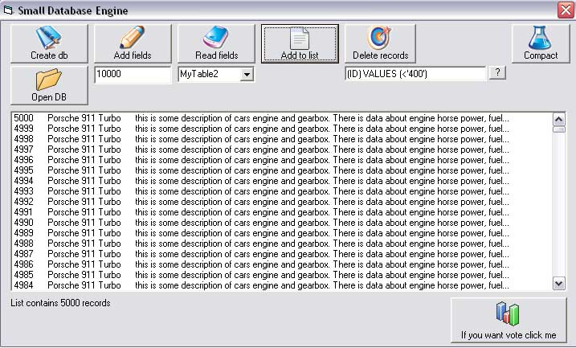



## small Database engine \(UPDATE\_2 speed increased\)

### Description

----

UPDATE: Now read is much faster (before 17 sec for 10000 records, now 0,3 sec)

----

DESCRIPTION:

This is sample of small database engine. It support few SQL queries, add muliple tables, add and DELETE records, username and password for access to databes data... There is also RecordSet class so this make it easiest to use.

Deleted items is only 'invisible' for reading, but they are still in file. So for real remove there is clsDbAdvanced class.

SQL Queries: CREATE TABE, INSERT INTO

For deleting data there is function (supports multiple conditions and operators =, &lt;&gt;, &gt;, &lt;)

For reading there is also function that sets data automaticly to RecordSet.

Please check it and leave feedback and if you wont wote.
 
### More Info
 

             |
---                |---
**Submitted On**   |2007-02-07 23:33:08
**By**             |[ivan stimac](https://github.com/Planet-Source-Code/PSCIndex/blob/master/ByAuthor/ivan-stimac.md)
**Level**          |Intermediate
**User Rating**    |4.9 (39 globes from 8 users)
**Compatibility**  |VB 6\.0
**Category**       |[Databases/ Data Access/ DAO/ ADO](https://github.com/Planet-Source-Code/PSCIndex/blob/master/ByCategory/databases-data-access-dao-ado__1-6.md)
**World**          |[Visual Basic](https://github.com/Planet-Source-Code/PSCIndex/blob/master/ByWorld/visual-basic.md)
**Archive File**   |[small\_Data204698282007\.zip](https://github.com/Planet-Source-Code/ivan-stimac-small-database-engine-update-2-speed-increased__1-67811/archive/master.zip)

